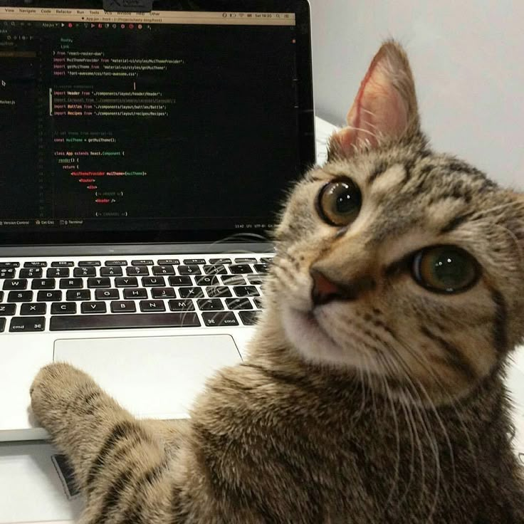

# Мой опыт
У меня нет качественного опыта в разработки программного обеспечения, так как на работе я занимаюсь моделированием и рассчетами, а на учебе до этого не было объемных дисциплин по программированию. 
Поэтому у меня на данный момент существует только один учебный аккаунт на github - [AlexChamk](https://github.com/AlexChamk)

Ранее мой опыт в программирование основывался на базовом курсе Python + матлаб и дополнительные библиотеки для вычислений, постороений графиков и работы с данными. 
В прошлом семестре я изучасла методы оптимизации. Этот курс помомог улучшить мои навыки, засчёт объемных работ, большая часть которых выполнялась как раз при помощи программировния.

# Мои цели
1. Освоить ключевые концепции и алгоритмы машинного обучения.

2. Научиться применять эти алгоритмы для решения практических задач.

# Мои задачи

1. Изучить основные модели машинного обучения и понять принципы их работы.

2. Разработать и обучить модели, используя современные библиотеки.

3. Проанализировать и интерпретировать результаты работы моделей на реальных данных.

